# Android Modular Template

A production-ready Android application template built with Jetpack Compose, Clean Architecture, and modern best practices. This template provides a solid foundation for building scalable Android applications with enterprise-grade architecture.

> **Note:** This is a template project. The recording and profile features are demo implementations showcasing architectural patterns and best practices. Use them as reference or replace with your own features.

## Why Use This Template?

- **One-Command Rebranding** - Rename the entire project in seconds
- **Production-Ready** - Firebase, security, CI/CD, monitoring all configured
- **Modern Stack** - Compose, Navigation3, Hilt, Room, Retrofit
- **Clean Architecture** - Multi-module structure with clear separation of concerns
- **Developer Experience** - Convention plugins, scaffolding, git hooks, comprehensive docs
- **Type-Safe Navigation** - Navigation3 with sealed routes and API modules
- **Security Built-In** - Encrypted token storage using Google Tink, ProGuard rules
- **Firebase Integration** - Analytics, Crashlytics, FCM, Remote Config ready to go
- **CI/CD Ready** - GitHub Actions workflows for testing, building, and deployment

## Template Features

### Core Infrastructure
- 🎨 **UI Layer**: Jetpack Compose with Material3, shared design system
- 🏗️ **Architecture**: Multi-module Clean Architecture with dependency rules
- 💉 **Dependency Injection**: Hilt with convention plugin setup
- 🧭 **Navigation**: Navigation3 with type-safe routing and feature isolation
- 🌐 **Networking**: Retrofit + OkHttp with JWT authentication and token refresh
- 💾 **Local Storage**: Room database + encrypted DataStore (Google Tink)
- 🔧 **Build System**: Gradle with Kotlin DSL + reusable convention plugins

### Production Features
- 📊 **Firebase Analytics** - Event tracking, screen views, user properties
- 💥 **Crashlytics** - Crash reporting with custom logging
- 🔔 **Push Notifications** - FCM integration with topic subscriptions
- 🎛️ **Remote Config** - Feature flags and A/B testing
- 🔐 **Security** - AES-256-GCM encryption for tokens, ProGuard/R8 obfuscation
- 🚀 **CI/CD** - GitHub Actions for testing, linting, building, deploying
- 🧪 **Testing** - Unit test infrastructure with mocking setup
- 📱 **Build Variants** - Dev/Prod flavors with different configurations

### Developer Tools
- 🛠️ **Feature Scaffolding** - Auto-generate new feature modules with one command
- 🎣 **Git Hooks** - Pre-commit checks for code quality (Detekt + tests)
- 📦 **Version Management** - Centralized version bump script
- 🐛 **Debug Tools** - LeakCanary (memory leaks) + Chucker (network inspector)
- 📚 **Documentation** - ADRs, API docs, setup guides, module READMEs

## Demo Features (Reference Implementations)

The template includes example features demonstrating best practices:

- **Recording Feature** (`feature:recording`) - Demonstrates camera/permissions, multi-feature navigation
- **Profile Feature** (`feature:profile`) - Shows basic CRUD operations and state management
- **Settings Feature** (`feature:settings`) - Example of preference management and build info display

**These are meant as learning examples** - feel free to keep, modify, or remove them for your project.

## Tech Stack

- **UI**: Jetpack Compose with Material3
- **Architecture**: Multi-module Clean Architecture
- **Dependency Injection**: Hilt
- **Navigation**: Navigation3 with type-safe routing
- **Networking**: Retrofit + OkHttp + Kotlinx Serialization
- **Local Storage**: Room + DataStore (encrypted with Google Tink)
- **Async**: Kotlin Coroutines + Flow
- **Build System**: Gradle with Kotlin DSL + Convention Plugins
- **Security**: Google Tink (AES-256-GCM), ProGuard/R8
- **Firebase**: Analytics, Crashlytics, FCM, Remote Config, Performance
- **Testing**: JUnit, MockK, Turbine (Flow testing)
- **Code Quality**: Detekt, Android Lint, Git Hooks

## Project Structure

```
android-modular-template/
├── app/                          # Main application module
├── core/
│   ├── ui/                      # Shared UI components, theme, design system
│   ├── common/                  # Infrastructure (dispatchers, scopes, DI qualifiers)
│   ├── navigation/              # Navigation3 setup, Navigator wrapper
│   ├── network/                 # Retrofit, OkHttp, auth interceptors
│   ├── data/                    # Repositories, data sources, Room database
│   ├── domain/                  # Business logic, use cases, domain models
│   ├── datastore/
│   │   ├── preferences/        # Encrypted token storage (Tink + DataStore)
│   │   └── proto/              # Proto DataStore (placeholder)
│   ├── analytics/              # Firebase Analytics + Crashlytics
│   ├── notifications/          # Firebase Cloud Messaging (FCM)
│   └── remoteconfig/           # Firebase Remote Config, feature flags
├── feature/
│   ├── recording/              # Demo: Recording feature (camera, permissions)
│   ├── profile/                # Demo: User profile management
│   └── settings/               # Demo: App settings screen
└── build-logic/                # Gradle convention plugins
```

### Type-Safe Cross-Feature Navigation

One of the unique features of this template is the **`:api` module pattern** for type-safe navigation between features without tight coupling:

```mermaid
graph LR
    subgraph Recording [":feature:recording"]
        RecordingImpl["RecordingScreen"]
    end

    subgraph RecordingAPI [":feature:recording:api"]
        RecordingRoute["RecordingRoute<br/>@Serializable"]
    end

    subgraph Profile [":feature:profile"]
        ProfileImpl["ProfileScreen"]
    end

    subgraph ProfileAPI [":feature:profile:api"]
        ProfileRoute["ProfileRoute<br/>@Serializable"]
    end

    RecordingImpl -->|depends on| ProfileAPI
    ProfileImpl -->|depends on| RecordingAPI

    RecordingImpl -.->|❌ NO dependency| ProfileImpl

    classDef implModule fill:#e1f5ff,stroke:#01579b,stroke-width:2px
    classDef apiModule fill:#fff3e0,stroke:#e65100,stroke-width:2px,stroke-dasharray: 5 5

    class Recording,Profile implModule
    class RecordingAPI,ProfileAPI apiModule
```



**Key Benefits:**
- ✅ **No tight coupling** - Features don't depend on each other's implementation
- ✅ **Type-safe navigation** - Compile-time safety with sealed interfaces & `@Serializable`
- ✅ **Independent development** - Teams can work on features in parallel
- ✅ **Easy testing** - Mock navigation contracts without full feature modules

**Example:** Recording feature can navigate to Profile by depending only on `:feature:profile:api`, not the entire `:feature:profile` module.

**📊 [View all architecture diagrams →](docs/images/architecture-mermaid.md)** (Module dependencies, Clean Architecture layers, Data flow, Build variants, Firebase integration, CI/CD pipeline)

## Getting Started

### Prerequisites

- Android Studio Ladybug (2024.2.1) or newer
- JDK 11 or higher
- Android SDK (API 30+)
- Git

### Quick Start: Rebrand for Your Project

**Step 1: Clone the template**
```bash
git clone https://github.com/yourusername/android-modular-template.git MyApp
cd MyApp
```

**Step 2: Rebrand in one command**

The template includes a powerful rebrand script that automatically renames everything:

```bash
# Interactive mode (recommended)
./rebrand.sh

# Or specify values directly
./rebrand.sh --project-name MyApp \
             --package-name com.mycompany.myapp \
             --app-name "My Awesome App"

# Preview changes first (dry run)
./rebrand.sh --project-name MyApp \
             --package-name com.mycompany.myapp \
             --dry-run

# Start with fresh git history
./rebrand.sh --project-name MyApp \
             --package-name com.mycompany.myapp \
             --reset-git
```

**📋 [See example output →](docs/rebrand-example-output.txt)** (shows what happens during rebranding)

**The script automatically:**
- ✅ Replaces package names (`com.example` → `com.mycompany.myapp`)
- ✅ Renames project (`MyApp`, `myapp`, etc.)
- ✅ Updates app display name
- ✅ Renames directory structure
- ✅ Updates all documentation
- ✅ Handles Firebase configurations
- ✅ Optionally resets git history

**Step 3: Firebase Setup** (Required)

Create Firebase project and download `google-services.json`:
- See detailed instructions in [GETTING_STARTED.md](GETTING_STARTED.md#12-firebase-configuration)

**Step 4: Build and run**
```bash
./gradlew :app:assembleDevDebug
```

### Manual Setup (Alternative)

If you prefer manual setup:

1. **Clone and open in Android Studio**
   ```bash
   git clone https://github.com/yourusername/android-modular-template.git
   cd android-modular-template
   ```

2. **Configure Firebase** (required for build)
   - See [GETTING_STARTED.md](GETTING_STARTED.md#12-firebase-configuration)
   - Download `google-services.json` to `app/` directory

3. **Sync and build**
   ```bash
   ./gradlew build
   ```

## Building

```bash
# Build all modules
./gradlew build

# Build specific variant
./gradlew :app:assembleDevDebug      # Dev environment, debug build
./gradlew :app:assembleProdRelease   # Production release build

# Run tests
./gradlew test                       # All unit tests
./gradlew connectedAndroidTest       # Instrumented tests (requires device)

# Code quality
./gradlew detekt                     # Static analysis
./gradlew lint                       # Android lint

# Clean build
./gradlew clean build
```

## Development Workflow

### Create a New Feature Module

Use the built-in scaffolding task:

```bash
./gradlew createFeature -PfeatureName=dashboard
```

This automatically creates:
- `:feature:dashboard` - Feature implementation module
- `:feature:dashboard:api` - Navigation routes (for cross-feature navigation)
- Proper build configuration, manifests, and boilerplate
- Updates `settings.gradle.kts`

### Version Management

```bash
./scripts/bump_version.sh patch  # 1.0.0 → 1.0.1 (bug fixes)
./scripts/bump_version.sh minor  # 1.0.0 → 1.1.0 (new features)
./scripts/bump_version.sh major  # 1.0.0 → 2.0.0 (breaking changes)
```

### Install Git Hooks

```bash
./install-hooks.sh
```

Pre-commit hooks run:
- Detekt static analysis
- Unit tests

## Architecture Highlights

### Multi-Module Design

- **Core modules** provide shared functionality (UI, networking, data, infrastructure)
- **Feature modules** are isolated and independently developable
- **Convention plugins** eliminate build configuration boilerplate
- Clear dependency rules prevent architectural violations

### Type-Safe Navigation

Features expose navigation through `:api` modules using Navigation3:

```kotlin
// In feature:profile:api module
@Serializable
sealed interface ProfileRoute : NavKey {
    @Serializable
    data class Profile(val userId: String) : ProfileRoute
}

fun Navigator.navigateToProfile(userId: String) {
    navigateTo(ProfileRoute.Profile(userId))
}
```

Other features depend on `:api` modules for navigation without tight coupling.

### Clean Network Layer

- JWT tokens stored securely with **Google Tink** (AES-256-GCM encryption)
- Automatic token refresh on 401 responses
- No circular dependencies (uses Dependency Inversion Principle)
- Encrypted in-memory cache for performance

### Convention Plugins System

Build configuration is centralized in `build-logic/` using reusable convention plugins:

- `convention.android.application` - For app module
- `convention.android.library` - For library modules
- `convention.android.feature` - For feature modules (includes Compose + Hilt)
- `convention.android.compose` - Adds Compose support
- `convention.android.hilt` - Adds Hilt DI
- `convention.android.room` - Adds Room database
- `convention.android.network` - Adds networking dependencies

SDK versions and build config are centralized in `AndroidConfig.kt` and `template.properties`.

## CI/CD

GitHub Actions workflows included:

- **CI** (`.github/workflows/ci.yml`) - Runs on every push/PR
  - Build all modules
  - Run unit tests
  - Run Detekt + Lint
  - Assemble debug and release APKs

- **Build Release APKs** (`.github/workflows/build-release.yml`) - Manual or on tags
  - Build unsigned release APKs
  - Upload artifacts
  - Create GitHub releases

See `GETTING_STARTED.md` for Play Store deployment setup.

## Documentation

### Getting Started
- **[GETTING_STARTED.md](GETTING_STARTED.md)** - 📍 **Start here!** Complete setup guide from local dev to Play Store

### Development
- **[CONTRIBUTING.md](CONTRIBUTING.md)** - Contribution guidelines, commit conventions, code style
- **[CLAUDE.md](CLAUDE.md)** - AI assistant guide with comprehensive architecture documentation

### Reference
- **[docs/architecture/](docs/architecture/)** - Architecture Decision Records (ADRs) - why we made key decisions
- **[docs/api/](docs/api/)** - API endpoint documentation and contracts

## Customization Guide

After rebranding:

1. **Remove demo features** (optional):
   - Delete `feature:recording`, `feature:profile`, `feature:settings` if not needed
   - Update `settings.gradle.kts` and app dependencies

2. **Configure Firebase**:
   - Update package names in Firebase Console
   - Download new `google-services.json`
   - Configure Analytics events, FCM topics, Remote Config keys

3. **Update API endpoints**:
   - Change URLs in `app/build.gradle.kts` (dev/prod flavors)
   - Implement real API services in `:core:data`

4. **Customize theme**:
   - Update colors, typography in `:core:ui`
   - Replace app icon and splash screen

5. **Add your features**:
   - Use `./gradlew createFeature -PfeatureName=yourfeature`
   - Follow existing patterns for consistency

## Troubleshooting

**Build fails with "google-services.json not found"**:
- See [GETTING_STARTED.md](GETTING_STARTED.md#12-firebase-configuration) for setup instructions
- For CI/CD, add `GOOGLE_SERVICES_JSON` GitHub secret

**Import/sync issues**:
```bash
./gradlew --stop
./gradlew clean build
```

**Git hooks not running**:
```bash
./install-hooks.sh
```

See [CONTRIBUTING.md](CONTRIBUTING.md) for more troubleshooting tips.

## Contributing

Contributions are welcome! See [CONTRIBUTING.md](CONTRIBUTING.md) for guidelines.

## License

MIT License - see [LICENSE](LICENSE) file for details.

---

**Created by [Moe Hamade](https://github.com/moehamade)** • Inspired by [Now in Android](https://github.com/android/nowinandroid)
