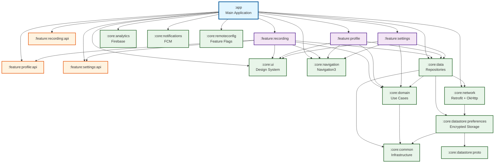
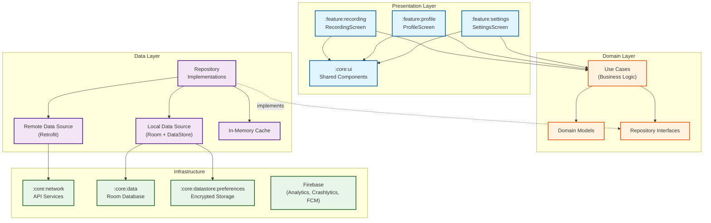
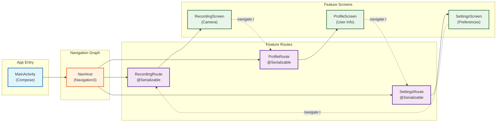
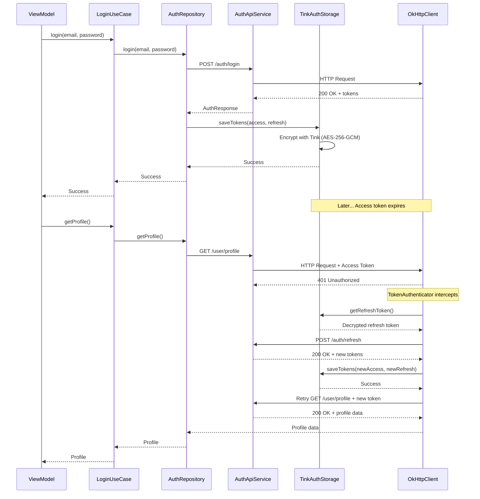
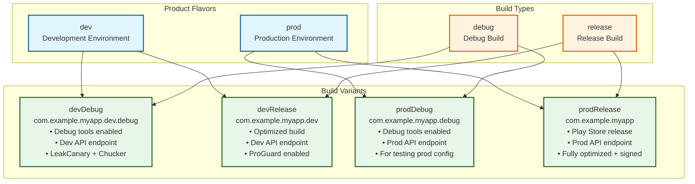
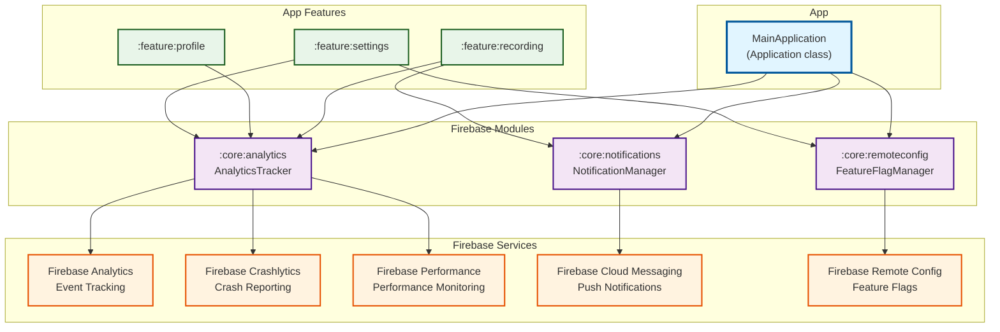
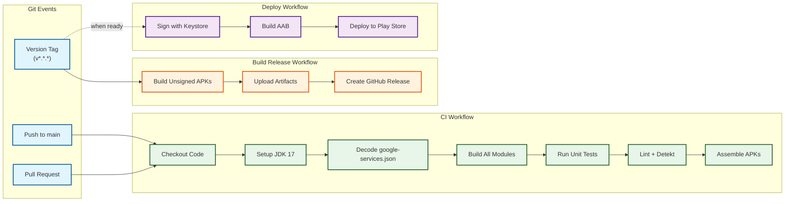

# Android Modular Template - Architecture Diagrams

These Mermaid diagrams can be viewed directly on GitHub or rendered in any Markdown viewer.

## Module Dependency Graph

## Clean Architecture Layers

## Navigation Flow

## Data Flow (Token Refresh Example)

## Build Variants Structure

## Firebase Integration

## CI/CD Pipeline

